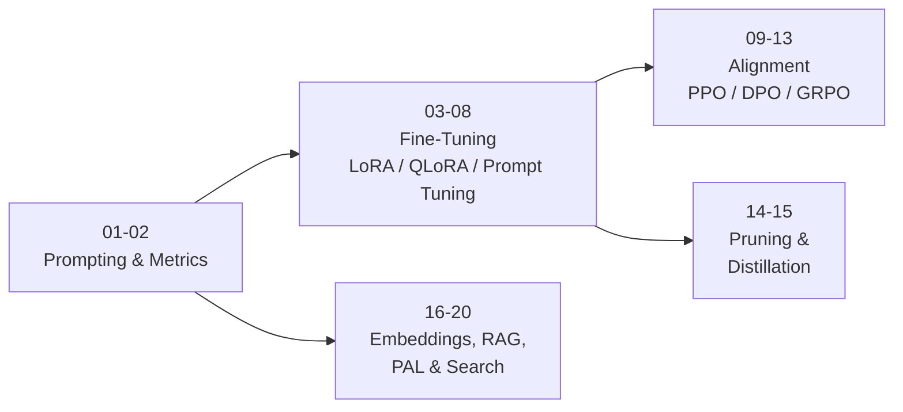

<div align="center">

# 🤖 Large Language Models (LLMs)

### Hands-on notebooks: fine-tuning, alignment, compression, RAG, and agents


</div>

---

## 📖 About

A practical, notebook-driven tour of modern **Large Language Model** techniques. The series moves from prompting and evaluation, through parameter-efficient fine-tuning, reinforcement-learning alignment (PPO, DPO, GRPO), and model compression, to retrieval-augmented generation and tool-using applications with LangChain.

| Area | What you'll find |
|---|---|
| 🧠 **Foundations** | In-context learning and evaluation metrics |
| 🔧 **Fine-Tuning** | Full fine-tuning, LoRA, QLoRA, and prompt tuning across several models and languages (including Persian) |
| 🎯 **Alignment & RL** | PPO, DPO, and GRPO, including reasoning (Chain-of-Thought) training |
| ⚡ **Compression** | Pruning and knowledge distillation |
| 🔎 **RAG & Agents** | Embeddings, RAG, PAL, and LangChain search |

---

## 🗂️ Notebooks

| # | Notebook | Description | Category |
|:-:|---|---|---|
| 01 | [`01_in-context-learning_summarize_dialogue_with_(flan-t5-base).ipynb`](./01_in-context-learning_summarize_dialogue_with_%28flan-t5-base%29.ipynb) | In-context learning: zero/one/few-shot dialogue summarization with FLAN-T5 | 🧠 Foundations |
| 02 | [`02_BLEU_score_TranslationMetric.ipynb`](./02_BLEU_score_TranslationMetric.ipynb) | BLEU score as a translation evaluation metric | 🧠 Foundations |
| 03 | [`03_Full-Fine-Tuning_PEFT(LoRA)_Dialogue-Summarization_with_(flan-t5).ipynb`](./03_Full-Fine-Tuning_PEFT%28LoRA%29_Dialogue-Summarization_with_%28flan-t5%29.ipynb) | Full fine-tuning vs. PEFT (LoRA) for dialogue summarization with FLAN-T5 | 🔧 Fine-Tuning |
| 04 | [`04_IMDB-Classifier(review sentiment analysis)_PEFT(QLoRA-Quantization)_with_(gemma-2b-it).ipynb`](./04_IMDB-Classifier%28review%20sentiment%20analysis%29_PEFT%28QLoRA-Quantization%29_with_%28gemma-2b-it%29.ipynb) | IMDB review sentiment classifier with QLoRA (4-bit quantization) on Gemma-2B-it | 🔧 Fine-Tuning |
| 05 | [`05_Persian-Translation__PEFT(QLoRA-Quantization)_with_gemma-2-9b-it_part1.ipynb`](./05_Persian-Translation__PEFT%28QLoRA-Quantization%29_with_gemma-2-9b-it_part1.ipynb) | Persian translation with QLoRA on Gemma-2-9B-it (Part 1) | 🔧 Fine-Tuning |
| 06 | [`06_Persian-Translation__PEFT(QLoRA-Quantization)_with_gemma-2-9b-it_part2.ipynb`](./06_Persian-Translation__PEFT%28QLoRA-Quantization%29_with_gemma-2-9b-it_part2.ipynb) | Persian translation with QLoRA on Gemma-2-9B-it (Part 2) | 🔧 Fine-Tuning |
| 07 | [`07_Prompt-Tuning_PEFT_with_bloomz-560m.ipynb`](./07_Prompt-Tuning_PEFT_with_bloomz-560m.ipynb) | Prompt tuning (PEFT) with BLOOMZ-560M | 🔧 Fine-Tuning |
| 08 | [`08_Persian-Poetry_Full-Fine-Tuning_with_gpt2-fa.ipynb`](./08_Persian-Poetry_Full-Fine-Tuning_with_gpt2-fa.ipynb) | Persian poetry generation: full fine-tuning of GPT-2 (Persian) | 🔧 Fine-Tuning |
| 09 | [`09_Fine-Tune_FLAN-T5_with_Reinforcement-Learning(PPO)_PEFT.ipynb`](./09_Fine-Tune_FLAN-T5_with_Reinforcement-Learning%28PPO%29_PEFT.ipynb) | RLHF-style fine-tuning of FLAN-T5 with PPO and PEFT | 🎯 Alignment & RL |
| 10 | [`10-Fine-Tune Qwen2.5-0.5B-Instruct_with_Reinforcement-Learning(DPO).ipynb`](./10-Fine-Tune%20Qwen2.5-0.5B-Instruct_with_Reinforcement-Learning%28DPO%29.ipynb) | Direct Preference Optimization (DPO) on Qwen2.5-0.5B-Instruct | 🎯 Alignment & RL |
| 11 | [`11_Reinforcement-Learning_Aligning_DPO_PEFT(QLoRA-Quantization)_with_Phi-3-mini-4k-instruct.ipynb`](./11_Reinforcement-Learning_Aligning_DPO_PEFT%28QLoRA-Quantization%29_with_Phi-3-mini-4k-instruct.ipynb) | Aligning Phi-3-mini-4k-instruct with DPO + QLoRA | 🎯 Alignment & RL |
| 12 | [`12_Fine-Tune_SmolLM-135M-Instruct_with_Reinforcement-Learning(GRPO)_PEFT(LoRA).ipynb`](./12_Fine-Tune_SmolLM-135M-Instruct_with_Reinforcement-Learning%28GRPO%29_PEFT%28LoRA%29.ipynb) | GRPO reinforcement learning on SmolLM-135M-Instruct with LoRA | 🎯 Alignment & RL |
| 13 | [`13_Fine-Tune_Qwen2.5-3B-Instruct_CoT_with_GRPO_PEFT(QLoRA-Quantization)_unsloth-vllm-libraries.ipynb`](./13_Fine-Tune_Qwen2.5-3B-Instruct_CoT_with_GRPO_PEFT%28QLoRA-Quantization%29_unsloth-vllm-libraries.ipynb) | Chain-of-Thought reasoning with GRPO + QLoRA on Qwen2.5-3B-Instruct using Unsloth and vLLM | 🎯 Alignment & RL |
| 14 | [`14_Pruning_Llama-3.2-1B.ipynb`](./14_Pruning_Llama-3.2-1B.ipynb) | Pruning Llama-3.2-1B to shrink the model | ⚡ Compression |
| 15 | [`15_Knowledge-Distillation_Llama-3.2-1B.ipynb`](./15_Knowledge-Distillation_Llama-3.2-1B.ipynb) | Knowledge distillation with Llama-3.2-1B | ⚡ Compression |
| 16 | [`16_intro_Embedding_with_paraphrase-multilingual-MiniLM-L12-v2_langchain_huggingface.ipynb`](./16_intro_Embedding_with_paraphrase-multilingual-MiniLM-L12-v2_langchain_huggingface.ipynb) | Intro to text embeddings (multilingual MiniLM) with LangChain and Hugging Face | 🔎 RAG & Agents |
| 17 | [`17_RAG_Examples.ipynb`](./17_RAG_Examples.ipynb) | Retrieval-Augmented Generation (RAG) examples, using the sample PDF | 🔎 RAG & Agents |
| 18 | [`18_PAL(Program-aidedLanguageModels).ipynb`](./18_PAL%28Program-aidedLanguageModels%29.ipynb) | Program-Aided Language Models (PAL): offloading reasoning to code | 🔎 RAG & Agents |
| 19 | [`19_Langchain-Search.ipynb`](./19_Langchain-Search.ipynb) | Search with LangChain | 🔎 RAG & Agents |
| 20 | [`20_Langchain_web-search.ipynb`](./20_Langchain_web-search.ipynb) | Web search with LangChain | 🔎 RAG & Agents |

**📎 Extra file:** [`sample_doc_for_RAG_notebook17.pdf`](./sample_doc_for_RAG_notebook17.pdf), the sample document used by notebook 17.

---

## 🧭 Learning Path



---

## 🚀 Getting Started

### 1. Clone the repository

```bash
git clone https://github.com/kasraSMD/LLMs-Large-Language-Models.git
cd LLMs-Large-Language-Models
```

### 2. Create an environment (recommended)

```bash
python -m venv venv
source venv/bin/activate        # Windows: venv\Scripts\activate
```

### 3. Install core dependencies

```bash
pip install torch transformers datasets peft trl accelerate bitsandbytes evaluate
pip install langchain langchain-community langchain-huggingface sentence-transformers jupyter
```

> 💡 Each notebook installs its own extras in the first cells (for example `unsloth` and `vllm` in notebook 13). Always check the top of a notebook before running it.

### 4. Launch Jupyter

```bash
jupyter notebook
```

> ☁️ **GPU recommended.** Most fine-tuning notebooks (especially 05–06, 11, and 13) need a GPU. [Google Colab](https://colab.research.google.com/) or Kaggle works well. Some models, such as Gemma, Llama, and Phi, may require accepting their license and logging in to Hugging Face (`huggingface-cli login`).

---

## 🧰 Tech Stack

- **[🤗 Transformers](https://huggingface.co/docs/transformers)**: models and tokenizers
- **[PEFT](https://huggingface.co/docs/peft)**: LoRA, QLoRA, and prompt tuning
- **[TRL](https://huggingface.co/docs/trl)**: PPO, DPO, and GRPO training
- **[bitsandbytes](https://github.com/bitsandbytes-foundation/bitsandbytes)**: 4-bit quantization
- **[Unsloth](https://github.com/unslothai/unsloth) and [vLLM](https://github.com/vllm-project/vllm)**: fast training and inference
- **[LangChain](https://www.langchain.com/)**: embeddings, RAG, and search tools

## 🤖 Models Used

`FLAN-T5` · `Gemma-2B-it` · `Gemma-2-9B-it` · `BLOOMZ-560M` · `GPT-2 (fa)` · `Qwen2.5-0.5B / 3B-Instruct` · `Phi-3-mini-4k-instruct` · `SmolLM-135M-Instruct` · `Llama-3.2-1B` · `paraphrase-multilingual-MiniLM-L12-v2`

---

## 🎯 What You'll Learn

- ✅ Prompt LLMs with in-context learning and evaluate outputs with metrics like BLEU
- ✅ Choose between full fine-tuning and **PEFT** (LoRA, QLoRA, prompt tuning)
- ✅ Fine-tune big models on limited hardware with **4-bit quantization**
- ✅ Align models with **PPO**, **DPO**, and **GRPO**
- ✅ Train reasoning behavior (Chain-of-Thought) with reinforcement learning
- ✅ Shrink models via **pruning** and **knowledge distillation**
- ✅ Build **RAG** pipelines and add search or code-execution tools

---

## 🤝 Contributing

Suggestions and improvements are welcome. Feel free to open an issue or submit a pull request.

## 📄 License

This project is licensed under the [MIT License](./LICENSE).

---

<div align="center">

⭐ If you find this repository useful, please consider giving it a star! ⭐

Made with ❤️ by [kasraSMD](https://github.com/kasraSMD)

</div>
